# UNDER CONSTRUCTION FOR THE NEXT WEEK OR TWO  
## TODAY IS APRIL 24, 2021
----------------------------------------------------------------------------------------------------

# My Task Time Tracker

* **What**: A free, lean task and time tracker with a simple user interface and several reports for analysis. 
* **When**: Use it daily.  Use it consistently.  It literally takes just 3 to 4 minutes per day. 
* **Who**: Built as a standalone tool for individual contributors working from a desktop or laptop computer. 
* **Why**: Rollup your time for better estimates, for better performance review discussions, to help optimize where effort gets focused, or just to set expectations for how long a complex thought-work-task takes. 
* **How**: Simple, low-tech, minimalist data entry that rolls up your time and tasks into meaningful, actionable reports. 
* **Where**: On a desktop or laptop.  **Requires Microsoft Access 365**.  Yep, it is a VBA application, [read here for why](https://github.com/DataResearchLabs/my_task_time_tracker/blob/main/src/SOURCE_CODE.md#whyMicrosoftAccess)
* **Source Code**: is open-source. Either (a) close all forms and press F11, **OR** (b) hold down the Shift-key when you open the application to access ALL source code.
* **License**: Creative Commons Zero, effectively public domain.  Free to use.  Free to copy.  Free to alter.  Free to distribute. 
Am happy if you find this tool useful and visit my [YouTube site](http://www.dataresearchlabs.com/) for training and additional tools. 

<kbd>
  
</kbd>
 
 
 

***If you like this tool, be sure to click the "Star" button above in GitHub.***

***Also, be sure to visit or subscribe to our YouTube channel*** www.DataResearchLabs.com! 

 

## Table of Contents
 - <a href="#introduction">1. Introduction</a>
 - <a href="#installation">2. Installation</a>
 - <a href="#gettingStarted">3. Getting Started, Configure Metadata</a>
 - <a href="#dailyTimeEntry">4. "Daily Time Entry" Sheet</a>
 - <a href="#reports">5. "Reports" Worksheet</a>
 - <a href="#import">6. "Upgrade/Import" Worksheet</a>
 - <a href="#about">7. "About" Worksheet</a>
 - <a href="#advancedTopics">8. Advanced Tips & Tricks</a>
 - <a href="#wrapup">9. Wrap Up</a>

### 1. Introduction 
#### 1.1 Ten Reasons Why You Should Track and Analyze Your Time...

1. **Monitoring Value**: If time is more valuable than money, why do so few track it relative to tracking money?

2. **Your Story**: "It is performance review time...what did you accomplish last quarter or last year?"
    * Managers are too busy to notice all the great work you do...so package it up into easily digestable projects, tasks, times, and dates. 
    * Sell your work story...because nobody else is going to do it for you. 

3. **Red Light - Green Light**: Wouldn't it be nice to tag and rollup all your tasks to identify activities like meetings that are potentially misusing or even wasting time:
    * **Green Light**: What you were hired to do 
    * **Yellow Light**: What can be delegated or packaged for a peer 
    * **Orange Light**: What may be important, but not what you were hired to do 
    * **Red Light**: What wastes time, not what you were hired to do 

4. **Self-Improvement**: by comparing efficiency of similar tasks and projects over time against yourself (bad idea to compare to others, stick to improving yourself). 

5. **Scope Creep**: When you monitor where your time is going, you can quickly show the impact of scope creep and course correct earlier 

6. **Happiness**: If you are grinding away focusing 100% fo your time on critical tasks with no 5% or 10% creative slow-down time, then you are likely on a path to burn-out.  Use these metrics to make the case for saying "No" more frequently, or to ask for a little bit of R&D time. 

7. **Tee-Shirt Baselines**: Rollup project times to establish historical baselines used for preliminary estimates or to counter unrealistic project timelines. 

8. **Just Billable Hours?** If you are a consultant, you already track your time for billing hours, **'nuff said, right**?
    * Not quite, because there is value beyond billing hours... 
    * You can slice and dice the hours, to see how they rollup to projects, to categories, and how the time flows 
  (a 40 hour task does not take 1 week, the hours ebb and flow at different rates, mingling with other tasks and priorities) 

9. **Time Boxing**: If you work on agile projects and need to time box certain activities, how do you know when you've hit the limit? 

10. **Dial in Your Estimates**: to improve your pipeline...  
    * The construction industry has this down in spades
      * How much does it cost per square foot of building footprint to build a 3 story building with wood beam construction, etc., etc. 
      * Check out [RS Means](https://psu.pb.unizin.org/app/uploads/sites/138/2019/11/Fig-7-2.png) and their thousands of ways to estimate anything construction related. 
      * This accuracy in construction estimates exists only because they track costs AND TIME.
    * Now compare that against the laughable lack of estimating accuracy and depth in the software industry. 
      * In construction, labor is ~50% of the cost. 
      * In software, labor is like 90%+ of the cost; therefore, tracking time is even more important...yet it is rarely done.   
 

#### 1.2 How Best to Track and Analyze Where Your Time Goes...
Use a simple software tool to track and analyze your time.  There are a lot of [excellent online tools](https://clockify.me/best-time-tracking-apps) out there, including Clockify, TogglTrack, Harvest, Hubstaff, RescueTime, TimeDoctor, Timecamp, Timely, and Everhour.   All cost money except for those having a base free option with limited functionality.  Many of these tool work on your cell phone and are accessible from anywhere on the web.  All great features. 

So, why would you want to download and use this Microsoft Access application tying you to a PC?  In short, because it is 100% free, simple, full-featured, and emphasizes both the tracking and the analyzing parts of the question. 
 

### 2. Installation

#### 2.1 Download
To download the "My Task Time Tracker" tool (Microsoft Access 365 ACCDB) from this repository's "/download" folder,
1. [Right-click here then select "Open in New Tab"](https://github.com/DataResearchLabs/my_task_time_tracker/blob/main/download/MyTaskTimeTracker.accdb)
2. Then click the download button
3. Then cilck the 'Open Folder' button (or '...' button) at browser Open File popup
4. Then copy the "MyTaskTimeTracker.accdb" file

#### 2.2 Deploy
1. Identify or create a "parent" folder (referred to as "$" henceforth) somewhere on your computer that is the "root" to house all the test case data files.  For example: "c:\tools\my_task_time_tracker" could be your root folder.
2. Paste a copy of the downloaded "MyTaskTimeTracker.accdb" into the new "$" folder
3. Optionally create a shortcut on your desktop, or your Windows start menu or your system tray for quick access.  If you do, in one of the videos I will walkthru howto customize an icon for that shortcut.
 

### 3. Getting Started, Configure the Metadata
#### 3.1 First Open / Security Notice
The first time you open MyTaskTimeTracker.accdb, Microsoft Access security is going to pop a warning message that "some active content disabled", meaning that VBA code will not run and thus the application will not function properly.
  * The screenshot below shows the security warning message (blue dot #1). 
  * Go ahead and click the "Enable Content" button (blue dot #2) to allow VBA code to execute and open the application with complete functionality. 
  * Once done, you will not be asked again, unless you move the MyTaskTimeTracker.accdb file into a different folder. 
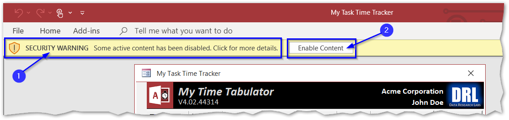
 

#### 3.2 "Landing Page" = Main Form
The "landing page" that first pops up happens to also be the main page where you will do all your time entries and from which you can launch various popup metadata entry forms, run analysis reports, etc.  The form layout is:
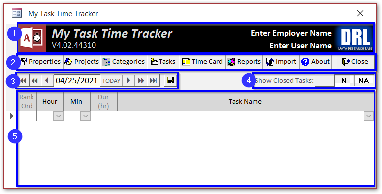
1. **Form Header**: At blue dot #1 contains the application name, version, and DataResearchLabs logo.  It also contains your company name and your name which we will fill out soon. 
2. **Toolbar**: At blue dot #2 contains buttons to perform various actions such as populating metadata (properties, projects, categories, and tasks), or running reports (timecard, tasks by project or category, etc.).
3. **Navigation**: At blue dot #3 contains buttons to move the view around to different days, or to save the current days entries or changes.  There are three left buttons and three right buttons. The "|<<" and "|>>" buttons move all the way to the end (first or last) day.  The "<<" and ">>" buttons move backward or forward one week.  The "<" and ">" buttons move backwards or forwards one day.  The 3.5" floppy disk button saves the daily entries changed below.
4. **Task Filters**:  At blue dot #4 contains three buttons to limit what tasks show up in the TaskName dropdown lists below.  After using this tool for months, you will have any completed tasks (IsClosed="Yes") which you do not want to keep scrolling thru when selecting a task for a time span.
5. **Daily Time Entry**: At blue dot #5 is where you enter your daily tasks and times. 
 

#### 3.3 Setup Properties
Before you can enter any tasks and times, you will need to enter metadata.  Start with the Properties metadata:
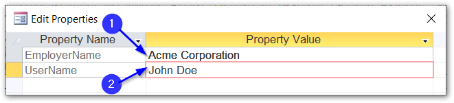
1. **Open**: Start by clicking the "Properties" button to popup the "Edit Properties" dialog.  This is a simple name-value pair dialog. 
2. **Data Entry**: Enter your employer's name at blue dot#1, and your name at blue dot#2. 
3. **Close**: Then click the [x] in upper right corner of form to close and return to the main form.  These two values will show up on screens and reports throughout the system. 
 

#### 3.4 Setup Projects
Next, enter some Project metadata:
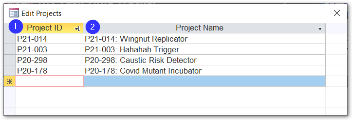
1. **Open**: Click the "Projects" button to popup the "Edit Projects" dialog.  This also is a simple name-value pair dialog. 
2. **Data Entry**: Enter Project ID's at blue dot#1, and Project Names as blue dot#2. 
3. **Naming**: Choose whatever you want for naming conventions (numeric, alpha numeric mix, etc.). 
4. **Add More**: Continue to add projects by filling out Project ID's and Names in the "\*" row. 
5. **Close**: Then click the [x] in upper right corner of form to close and return to the main form. 

**NOTES**:
* You will continually be adding projects over time. 
* Tasks (discussed below) all rollup into projects. 
* There is only one level of projects, so if you need "epics", be sure to name them with a prefix abbreviation accordingly (eg: "ALPHA: (1) blah blah", "ALPHA: (2) blah blah), or something similar). 
* These values show up in the Task Edit page as the drop down filter, and on many reports as a grouping, sorting, and rollup parameter. 
* There is a hidden Project "NA" that you cannot edit or remove.  It exists for the task "--BREAK--". 
 
 

#### 3.5 Setup Categories
Next, enter some Project metadata:
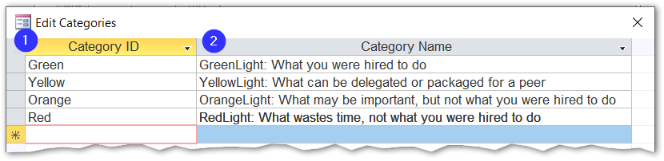
1. **Open**: Click the "Categories" button to popup the "Edit Categories" dialog. This also is a simple name-value pair dialog. 
2. **Data Entry**: Enter Category ID's at blue dot#1, and Category names as blue dot#2. 
3. **Naming**: Choose whatever categorizations and naming conventions you want (numeric, alpha numeric mix, etc.). 
4. **Add More**: Continue to add categories by filling out Cateogry ID's and Names in the "\*" row. 
5. **Close**: Then click the [x] in upper right corner of form to close and return to the main form. 

**NOTES**: 
* You may occasionally add or change categories over time, but they generally are set once and rarely change after that. 
* Use whatever categorization convention you want.  They are intended to be a way of analyzing where you can claw back some time on projects, or maybe as a monthly or quarterly self-retrospective. 
* This field used to be named WBS for Work-Breakdown-Structure with hieararchy, but was simplified over the years to just a single level list. 
* I tend to use:
  * **OH** for Overhead / or **MTG** for Meetings 
  * **PROJ** for Project and Task work 
  * **OOO** for Out-of-Office (PTO, sick leave, volunteer events, etc.) 
* But, I saw an [interesting article in Forbes](https://www.forbes.com/sites/markmurphy/2017/05/28/the-big-reason-why-you-need-to-start-tracking-your-time/?sh=2ba8af983e1d) that suggested tracking your time as:
  * **Green Light** - Good, What you were hired to do 
  * **Yellow Light** - Okay, Waht can be delegated or packaged for a peer 
  * **Orange Light** - Minimize, What may be important, but no what you were hired to do 
  * **Red Light** - Bad, What wastes time, not what you were hired to do 
* These values show up in the reports as grouping, sorting, and rollup parameters. 
* There is a hidden Category "NA" that you cannot edit or remove.  It exists for the task "--BREAK--". 
 

#### 3.6 Setup Tasks
Next, enter some Tasks: 
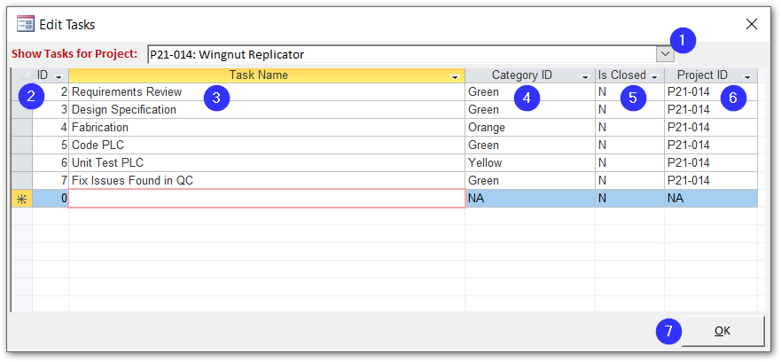
1. **Open**: Click the "Tasks" button to popup the "Edit Tasks" dialog.  This is more complex than the edit screesn above because there is a project to filter tasks, and more than just a name-value pair to enter per row. 
2. **Project**: Before you start entering task data, be sure you have selected the appropriate parent Project in the drop down at blue dot#1. 
3. **Ignore**: the Task ID at blue dot#2.  This is automatically calculated as the max value + 1.  (Used to be AutoNumber, but that caused issues with importing.) 
4. **TaskName**: Type in a Task Name at blue dot#3. 
5. **Category**: Select a category from the drop down at blue dot#4. 
6. **IsClosed**: At blue dot#5, select the task IsClosed status as:
    * "**N**" - When you first add a new task that is not closed
    * "**Y**" - Return here later to close out completed tasks with a "Y" 
    * "**NA**" - For tasks that will never be closed because it is an ongoing task (like a recurring meeting).  
    Typically, when you first add a task, it will start as "Y", then several days or weeks or months later you will return to this screen to flip the IsClosed value to "N".  However, you will have a few tasks that you initially set straight away to "NA" and never return to change. 
8. **ProjectID**: You typically just go with the default value in this field, because it is set based on the drop down in blue dot #1.
**However**, there may be times when you want to re-assign a task to a new project, or split tasks from one project out into two projects.  In those cases, just flip the ProjectID values for those tasks you wish to move. 
9. **Add More**: Continue to add tasks by filling out cells in the "\*" row. 
10. **Close**: When done adding or ediing tasks, click the "Ok" button at blue dot#7  close and return to the main form 

**NOTES**:
* You will continually be adding tasks over time. 
* You will continually be editign existing tasks at least once to close them out over time. 
* Tasks are the lowest level of granularity in the system, and they tie everything together relative to reporting. 
* Think through your naming convention on tasks. 
  * For example, for 90% of my tasks, they are unique so I just name them something meaningful without too much concern for convention other than consistent labeling of key phases or steps that will repeat across groups of tasks (eg: "design" or "data analysis" or "research" or "coding").
  * However, there are about 10% of tasks that are recurring, things like meetings, or 1x1's, or company retreats, or process improvement reviews.
  * For these I like to bucket them up into generic tasks that span forever, and label them something like: 
    * "@T1-MISC: Morning Emails, Update/Fix Computer, etc.",
    * "@T2-NPM: Non-Project Meetings", and  
    * "@T3-NPT: Non-Project Training",  
* There is a hidden Task "--BREAK--" that you cannot edit or remove.  It exists for marking the start of Lunch time, or the start of a short break, and to mark the end of your work day.  The duration column is never calculated for a "break" row, but the "break" row is used to derive the end date/time of the prior task.  Thus, entering "break" rows is important for the system to properly calculate task durations. 

### 4. "Daily Time Entry" Sheet
#### 4.1 Select Date
From the main task and time entry screen, the first thing you need to do is select a date.  Today's date is the default, so typically you do not need to change anything.  In the screenshot to the right, the various date selectors are tagged and defined as follows: 
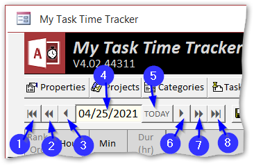

* Dot #1 = Jump to first date with time entries 
* Dot #2 = Move one week earlier 
* Dot #3 = Move one day prior 
* Dot #4 = Currently selected day for which tasks and times shown 
* Dot #5 = Jump to Today's date 
* Dot #6 = Move one day forward 
* Dot #7 = Move one week forward 
* Dot #8 = Jump to last date with time entries 
 

#### 4.2 Enter Tasks and Times
##### 4.2.1 First Row of a Day
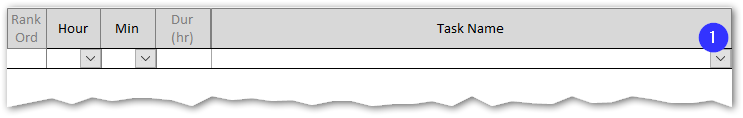
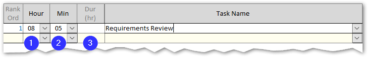

The entry form starts off blank each day.  Go ahead and select a TaskName from the dropdown (blue dot#1) and the current hour and minute will be automatically set.  Go ahead and set it back a couple of hours. 
* **Before=Blank**: The screenshot on top is the initial state.
* **After=Auto-Calc**: Notice in the lower screenshot that the hour and time cells (blue dots#1 and #2) were automatically set to right now.
* **Change=Possible**: You can change the hour and minute dropdown values.
* **Duration=Blank**: Notice that duration (blue dot#3) is blank; that is because it takes both a start **and** an end time to calculate a duration (two tasks).

##### 4.2.2 Second Row of a Day
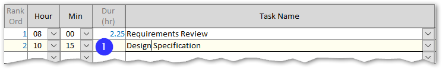

Now, enter a second task and time on the second row, using the current time and hour.
* **Dur=Auto-Calc**: Notice that the Dur (durationin hours) of the first task has now been automatically calculated.  This is because it has a boundary (end time) as established by the second task start time.
* **RankOrd=Auto-Calc**: The Rank Order column on the far left of the grid is also automatically calculated.  Both it and duration are in a lighter blue color, indicating that they are calculated and un-editable by design.
* **24 Hour**: Notice that the time drop down contains the hours 00 thru 23, not 00-12 with AM and PM.  This was in part for efficiency (one less column to enter for each row) and partly to make coding easier.  I originally had AM or PM in a dropdown, but got to the report modifications and realized it was just not worth the complexity and extra effort.  **TIP** - Just add 12 to arrive at the appropriate military time (example: 5PM + 12 = 17-hundred hours; or 10PM +12 = 22-hundred hours). 

##### 4.2.3 Special "--BREAK--" Task
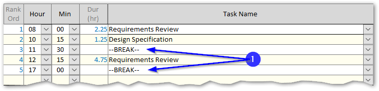

So how do you handle lunch breaks, and the End-Of-Day marker that sets the end times for duration calculations on the last task before lunch or break, and the last task of the day?  The answer is to select the system Task "--BREAK--" as shown in blue dor#1 to the right.  the first break enables task #2 to auto calculate 1.25 hr, and the last break eanbles task 4 to auto calculate at 4.75 hr.
 
 

#### 4.3 Filter to Hide or Show Tasks in Dropdown
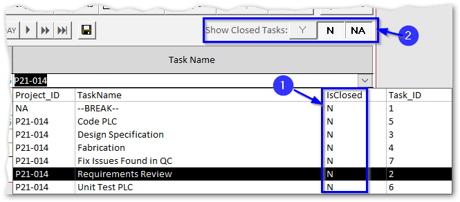

After many months, you will have created dozens if not a hundred or more tasks.  That becomes cumbersome to scroll thru when making task selections.  Thus, wouldn't it be nice if the tasks in the drop could be filtered by the column value at blue dot#1?  Well, happily blue dot#2 shows three such filter buttons:
* **"Y"** = Show closed tasks, where IsClosed=Yes
* **"N"** = Show open tasks, where IsClosed=No
* **"NA"** = Show NA tasks, where IsClosed=NA
* **Default** state is Yes=up, No=down, and NA=down
 

#### 4.4 Save Daily Entry Ledger
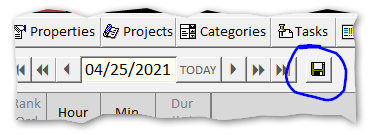

* **Save Button** When you are done entering tasks and times, click the save button (circled in blue to the right) to commit your changes to the database.
* **Change Days** If you attempt to change days, or click any toolbar buttons, you will be prompted whether to save changes (or discard them if you reply No).
 

#### 4.5 Weekly Time Card
To view a Weekly Time Card report, first select a day having tasks and times populated during a given week of interest.  Then click the "Time Card" button on the toolbar.  The following report will popup. 
Numbered blue bullet points below identify the various report elements.
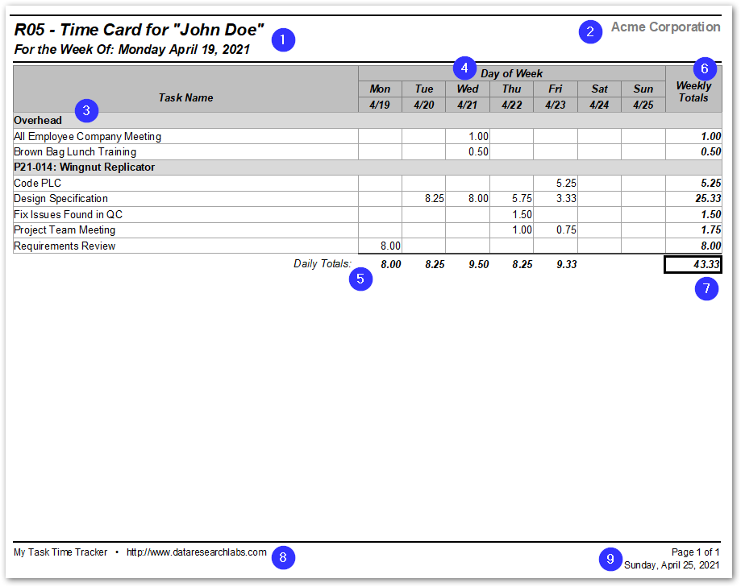

1.  **Header-Left**: Contains the report name, your name, and the week's starting date.
2.  **Header-Right**: Contains your company's name.
3.  **Task Names**: Are grouped by Project Name and ordered by task name.  Multiple time entries for the same task on the same day are rolled up to a single row here.
4.  **Day of Week**: Lists the Day of Week name (Mon, Tue, etc.) as well as the Date (month/day, no year).
5.  **Daily Totals**: How many hours you worked on a given day is vertically totalled here.
6.  **Weekly Totals**: How many hours you worked on a given task for the week is horizontally totalled here.
7.  **Total Hours**: For the week are summed up here.
8.  **Footer-Left**: Contains the application name, and DataResearchLabs' name.
9.  **Footer-Right**: Contains the apge number and report run date.

**Suggestion**: Occasionally, as needed, screenshot just the table section of this report and paste into a weekly status email to your manager or project team.  You could also IM or email a screenshot as a scrum attendance substitute when appropriate. 
 

### 5. Reports
#### 5.1 Opening Report Wizard
To view reports, start by cilcking the "Reports" button on the main screen's toolbar.  That will popup the Run Report Wizard consisting of two steps. 

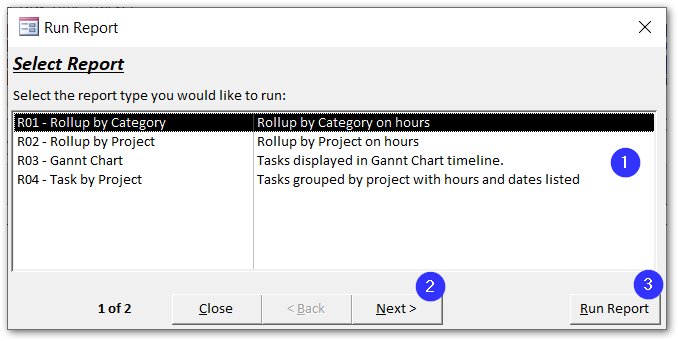

#### 5.2 Step #1 - Select Report
* **Dot #1**: Currently, there are four reports to select from in the listbox 
* **Dot #2**: If you want to filter the data in the report, click the "Next" button 
* **Dot #3**: If you want to run the report against all data across all time, click the "Run Report" button 
* The selected report will popup in print preview mode 
  

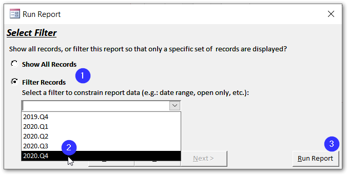

#### 5.3 Step #2 - Select Filter
* **Dot #1**: Select option button "Filter Records", or leave default value "Show All Records" selected 
* **Dot #2**: Select a saved filter that you previously created in the Filter Builder (how to build discussed below in section 5.3) 
* **Dot #3**: Click "Run Report" button 
* The selected report will popup in print preview mode 
  

#### 5.3 Build Filters
To edit or add a filter, click the "Build Filter" button on Step #2 of the Report Wizard. That will popup the Build Filters dialog box to the right.  Each element on the form is tagged with a blue dot corresopnding to the number list below.

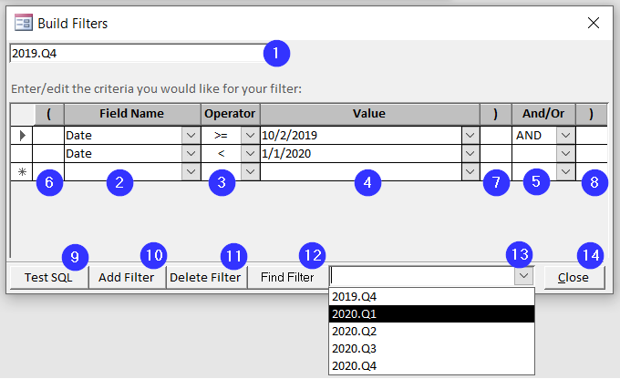

1. **Filter Name**: This is the filter name, you can type in here to rename a filter 
2. **Field Name**: Each row is another filter criteria.  Start off by selecting a field whose values by which you want to constrain 
3. **Operator**: Select whether you want equal, less than, greater than etc. from this dropdown (note: there is NO between operator, just use two rows with one "greater than or equal to" and the other "less than or equal to". 
4. **Value**: Select a value to compare against; these are actual values from the daily entries (you cannot type a value in) 
5. **Logical Operator**: If you have more than one row of filter logic, you need to tie it together with "AND" or "OR" 
6. **Paranthesis**: Depending on the complexity of your filter logic, you may need to incorporate parantheses 
7. **More Paranthesis...** 
8. **More Paranthesis...** 
9. **Test SQL**: Click this button to test with your filter logic entered above generates valid SQL.  Yuo will get a message box either indicating the SQL logic passes, or it fails with limited details. 
10. **Add Filter**: Click this to button to add a new filter behind the form.  You will need to enter a name (blue dot#1) and make criteria selctions (blue dot#2-8).  Your add is saved as you enter data. 
11. **Delete Filter**: Click this button to delete the currently selected (visible) filter. 
12. **Find Filter**: Cilck this button to popup a dropdown to the right (blue dot #13) 
13. **Select Filter**: Select an existing filter to jump to for editing.  Upon clicking a filter name, the drop down disappears and the form jumps to the selected filter so that you can start editing. 
14. **Close**: Click when you are done to return to the prior screen. 
 

#### 5.6 "R01 - Rollup by Category" Report Interpetation Guide
The "Rollup by Category" report is a short (1 row per category) summary of where the time went as measured by the Category buckets you create.  In the example below, the category choice was probably not all that great.  See the <a href="#introduction">Introduction</a> for a better way to layout your categories (red-ilght/green-light). 
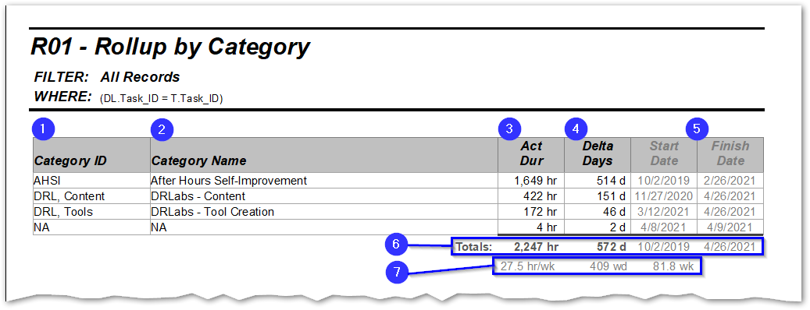

The report elements identified by blue dots in the screenshot above are as follows:
1. **Category ID**: that you assigned in the Edit Categories screen. 
2. **Category Name**: that you set in the Edit Categories screen. 
3. **Actual Dur**: The actual duration in hours totalled up for the category, given whatever filter constraints you have applied. 
4. **Delta Days**: The number of days between when the start and finish dates for the category bucket.  The point of this column is to emphasize that you can never divide hours by 8 (per day) and arrive at the number of days a task requires.  Tasks always get spread out across multiple days with the ebb and flow of priorities, lead and lag times, etc. 
5. **Start and Finish Date**: The start date is the earliest (min) date of all tasks in the category bucket.  The end date is the latest (max) date of all tasks in the category bucket. 
6. **Totals**: Sum of the ActDur column.  Minimum start and maximum end dates for those two columns.   Delta days is the difference between the smallest start date and largest finish date in the columns at blue dot #5. 
7. **Work Day Totals**: In the screenshot example, there were 572 calendar days, but only 409 business (or work) days.  Doing the math, that equals 27.5hr/wk across the 81.8 weeks tracked. 
 

#### 5.4 "R02 - Rollup by Project" Report Interpetation Guide
The "Rollup by Project" report is a short (1 row per project) summary of where the time went measured by Project. 
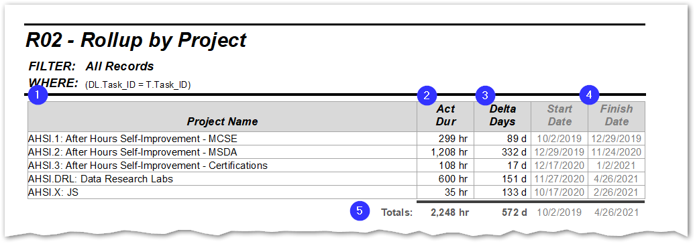

The report elements identified by blue dots in the screenshot above are as follows:
1. **Project Name**: The Project name you assigned in the Edit Projects screen.  Suggestion: prefix the project name with an abbreviation or project code so you can control the sort ordering and grouping. 
2. **Actual Dur**: The actual duration in hours totalled up for the category, given whatever filter constraints you have applied. 
3. **Delta Days**: The number of days between when the start and finish dates for the category bucket.  The point of this column is to emphasize that you can never divide hours by 8 (per day) and arrive at the number of days a task requires.  Tasks always get spread out across multiple days with the ebb and flow of priorities, lead and lag times, etc. 
4. **Start and Finish Date**: The start date is the earliest (min) date of all tasks in the category bucket.  The end date is the latest (max) date of all tasks in the category bucket. 
5. **Totals**: Sum of the ActDur column.  Minimum start and maximum end dates for those two columns.   Delta days is the difference between the smallest start date and largest finish date in the columns at blue dot #5.  
 

#### 5.5 "R03 - Gannt Chart" Report Interpetation Guide
Sometimes, you just need to layout the projects and all their tasks in a nice "Gannt Chart" report over time.  It tells the story of what happened and how things went. 
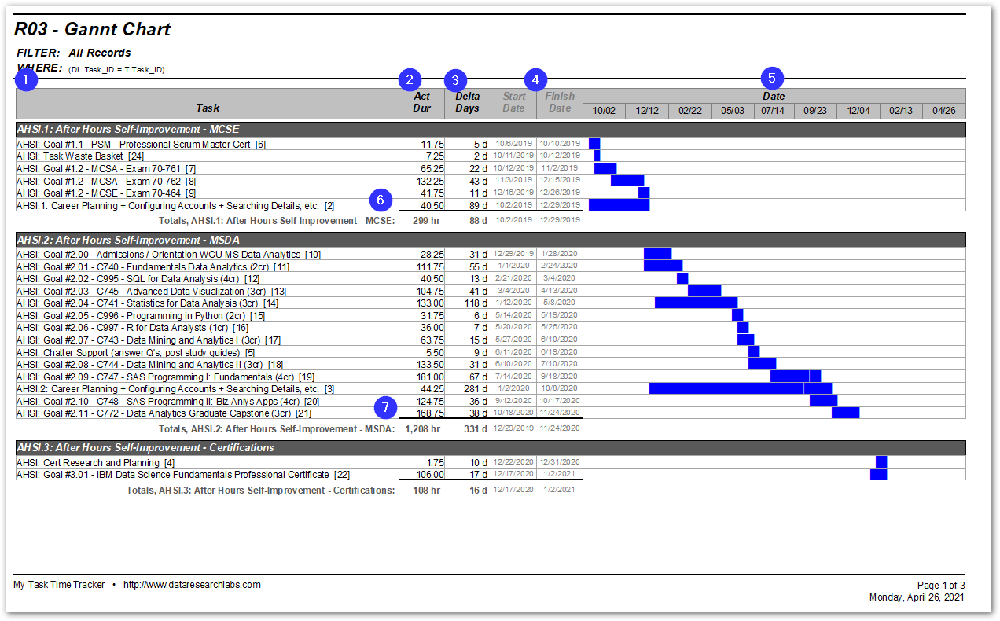

The report elements identified by blue dots in the screenshot above are as follows:
1. **Task Name**: The Task name you assigned in the Edit Tasks screen.  Suggestion: Prefix the task name with an abbreviation or naming convention so that you can control the sorting. 
2. **Actual Dur**: The actual duration in hours totalled up for the category, given whatever filter constraints you have applied. 
3. **Delta Days**: The number of days between when the start and finish dates for the category bucket.  The point of this column is to emphasize that you can never divide hours by 8 (per day) and arrive at the number of days a task requires.  Tasks always get spread out across multiple days with the ebb and flow of priorities, lead and lag times, etc. 
4. **Start and Finish Date**: The start date is the earliest (min) date of all tasks in the category bucket.  The end date is the latest (max) date of all tasks in the category bucket. 
5. **Gannt Bars**: A gannt chart consists of bars representing the start date thru the end date.  In the example above, you can see over time how the tasks in rows were worked horizontally by month/day in the blue bars.
6. **Project #1 Analysis**: Looking at this project MCSE, we can deduce that there were six tasks and three exams totalling 299 hours spread out over 88 days between 10/2/2019 and 12/29/2019 to obtain the certification. 
7. **Project #2 Analysis**: Looking at the project MSDA, we can deduce that there were eleven classes with three supporting tasks totalling 1,208 hours spread out over 331 days between 12/29/2019 and 11/24/2020 to obatin the MSDA degree. 
 

#### 5.6 "R04 - Task by Project" Report Interpetation Guide
The "Task by Project" report is a long and detailed (1 row per task).  Tasks are grouped under their respective Projects.  Totals are rolled up at the bottom of each project. 
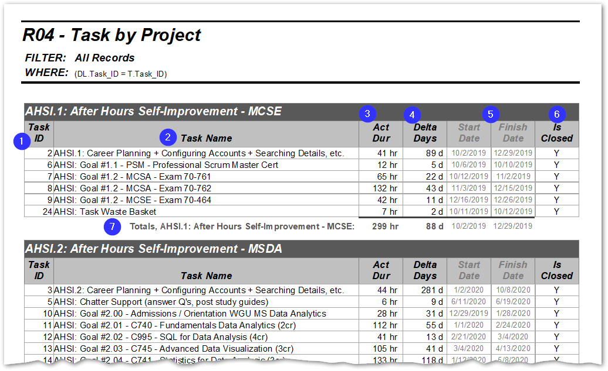

The report elements identified by blue dots in the screenshot above are as follows:
1. **Task ID**: that was automatically generated (max + 1). 
2. **Task Name**: that you set in the Edit Tasks screen. 
3. **Actual Dur**: The actual duration in hours totalled up for the category, given whatever filter constraints you have applied. 
4. **Delta Days**: The number of days between when the start and finish dates for the category bucket.  The point of this column is to emphasize that you can never divide hours by 8 (per day) and arrive at the number of days a task requires.  Tasks always get spread out across multiple days with the ebb and flow of priorities, lead and lag times, etc. 
5. **Start and Finish Date**: The start date is the earliest (min) date of all tasks in the category bucket.  The end date is the latest (max) date of all tasks in the category bucket. 
6. **IsClosed**: Indicating whether the task is closed (="Y"), open (="N"), or perpetual (="NA"). 
7. **Totals**: Sum of the ActDur column.  Minimum start and maximum end dates for those two columns.   Delta days is the difference between the smallest start date and largest finish date in the columns at blue dot #5. 
 

#### 5.7 "R06 - Task by Category" Report Interpetation Guide
The "Task by Category" report is virtually identical to the "Task by Project" in the previous section.  Only difference is it groups by Category rather than Project. 

### 6. Upgrade/Import
#### 6.1 Introduction
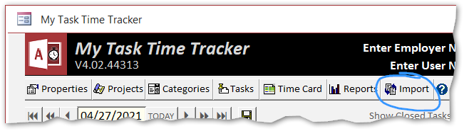
Although infrequent, occasionally a new version of "My Task Time Tracker" is released.  If you simply download and start using the new "MyTaskTimeTracker.accdb", all of your data would be missing.  The Import button on the main toolbar, circled in the screenshot to the right,  addresses this issue by importing all user data tables into the new application copy. 

#### 6.1 How To Import
1. IMPORTANT! The first step you do is make a backup copy of your current "MyTaskTimeTracker.accdb" file into a different folder as a precaution (so you can always rollback and use it again,as-is. 
2. IMPORTANT! The next step you do is rename your current "MyTaskTimeTracker.accdb" file so to something like "MyTaskTimeTracker_OLD.accdb" (suffix **\_OLD** tacked on to filename. 
3. Next download the latest "MyTaskTimeTracker.accdb" from the [DataResearchLabs GitHub site](https://github.com/DataResearchLabs/my_task_time_tracker/blob/main/download/MyTaskTimeTracker.accdb) 
4. Open in Folders  >  File Copy  >  File Paste into the same folder where your renamed "MyTaskTimeTracker_OLD.accdb" exists 
5. Open the new (empty) file "MyTaskTimeTracker.accdb".  Notice that the "Import" button is enabled. 
6. Click the "Import" button.   
7. Click 'Yes" to the prompt because you are indeed certain that you want to import data from an older copy. 
8. In the File Selector dialog, click the file "MyTaskTimeTracker_OLD.accdb" and click the Open button. 
9. You will likely be prompted with "Microsoft Access Security Notice" popups, one for every table imported (10 times total).  SIMPLY CLICK OPEN each time this dialog pops up (or you could have opened the "MyTaskTimeTracker_OLD.accdb" after you renamed it and cleared the first time open security there to avoid these steps. 
10. Once you are done clicking Open to all those security dialogs, YOUR DATA IS LOADED. 
11. Click back a day or a week, or even better run a report to confirm that all your data loaded properly. 
 

### 7. "About" Worksheet
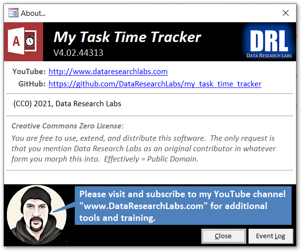
The "About" worksheet accomplishes a few goals. It informs the user... 

1. The "application" name and version. 
2. Where to watch training videos no YouTube. 
3. Where to find the online docs at GitHub. 
4. That the tool and all documentation are Creative Commons Zero license...effectively Public Domain which means I grant you full and free usage. 
 
I hope it helps you in your company and makes you more productive.  I am happy for you if you extend and modify or alter the tool.  Do what you need to do...that's what the About worksheet indicates.  One caveat, please do click the GitHub star button for this project, and visit the YouTube site and subscribe at www.dataresearchlabs.com. 

### 8. Advanced Tips & Tricks
#### 8.1 Rollup the Access Toolbar 
"Rollup the Microsoft Access Toolbar" for a cleaner user interface experience.  Look at the before (top) vs. after (bottom) views below to understand why you should click the button. 
 

**Before Screenshot:**  
Notice the visible toolbar taking up vertical space.  Click the button at Blue Dot #1 to rollup the toolbar. 
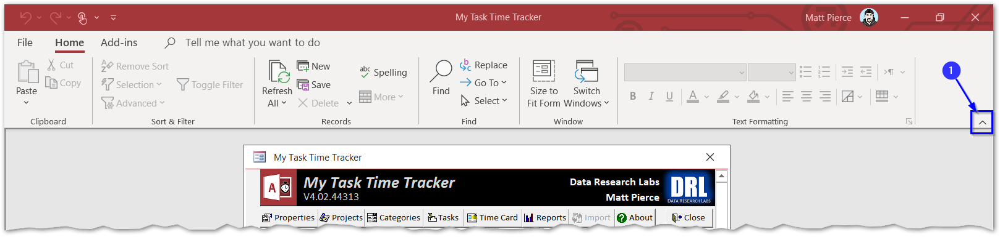
 
**After Screenshot:** 
Notice minimal clutter.  Click the "Home" menu item at Blue Dot #2 to re-expand the toolbar (you can optionally click the Tack button which will appear where Blue Dot#1 is on the prior screen above -- this will fix the toolbar in place). 
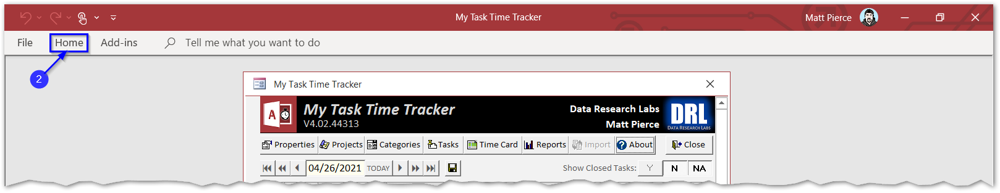
 

#### 8.2 - Routinely backup your .ACCDB file
It is a good practice to routinely backup your .ACCDB file.  

* If you have Microsoft OneDrive automatically backing up the folder where your "MyTaskTimeTracker.accdb" file resides, then you are fine. 
* If you have some other backup service capture the file, then you are fine. 
* If not to the above two bullets, then consider setting up a meeting in your Outlook or equivalent scheduler as a reminder to periodically (weekly? monthly?) go in and manually backup your file: 
  * Copy-paste your "MyTaskTimeTracker.accdb" file (application and data combined) 
  * Paste into a backup subfolder (e.g.: "MyTaskTimeTrackerFolder\backups") 
  * Rename the file by tacking on the date (e.g.: "MyTaskTimeTracker_20210427.accdb") 
 
 

### 9. Wrap Up
#### 9.1 Thank You
Thank you very much for reading all the way down to the end of the documentation.  Time is valuable and ever more scarce in today's busy world.  Few people make it this far.  If you did, I hope that means you found value in this tool.  I hope it makes you more productive.  I am happy if you adopt the application then change and evolve it to meet your needs (simply open the .ACCDB file with the Shift-Key held down to access all the source code).  I am happy if you fork this repository and build your own.  I am happy and would roll-in to the master branch any changes you might make from which others may benefit. Thank you for your use and support. 

#### 9.2 YouTube Training & Resources
If you like this tool, please visit and subscribe to the YouTube site at http://www.dataresearchlabs.com and check out video training for this "product" as well as other related tools and data or testing processes. 

#### 9.3 MTCM History
"My Task Time Tracker" has been a work in progress, arriving at version 4.02.xx over the last two plus decades. 

* **Ver 1.x** - At some point in 1994 I built my first Time Tracking app in FoxPro for school.  I no longer have access to any of that. 
* **Ver 2.x** - In late 1999, I started my first freeware hobby site "pb-sys.com" for Pierce Business Systems (retired in 2003).  Billit V2.55 was last deployed in October 2, 2000.  This version was pretty extensive.  I used it for my side business at the time to bill clients and generate invoices.  It had many more screens and more reports than the slimmed down version 4.xx "My Task Time Tracker" does today.  You can [check it out here on the wayback machine](https://web.archive.org/web/20030510162215fw_/http://www.matpie.drw.net/PBSystems/products/retired/Billit.html). 
* **Ver 3.x** - Between 200x and XXXX, for the next 15 years I used some modified and downsized version of Billit, keeping it current in the most recent version of Microsoft Access.  XXXXXXXXXXXXXXXXX  Over the next 10 years, I occasionally modified and used various incarnations of TCMLite for my day job.  In 2013, I used it fairly heavily for about a year at an insurance company to test software. 
* **Ver 4.x** - In early 2021, I started my third hobby site; this time not freeware focus but YouTube training focussed.  DataResearchLabs.com is slowly growing and I'd like YouTube viewership and gitHub visit/downloads to grow faster.  XXXXXXXXXXXXXXXXXXXXXXXXXXXXX 
 

