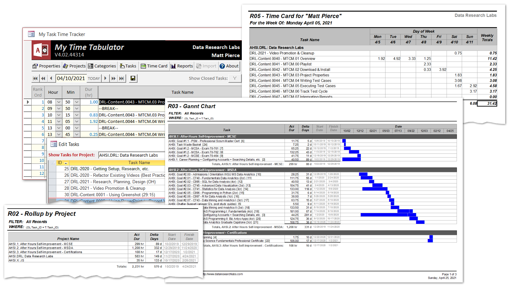

# UNDER CONSTRUCTION FOR THE NEXT WEEK OR TWO  
## TODAY IS APRIL 24, 2021
----------------------------------------------------------------------------------------------------

# My Task Time Tracker

* **What**: A free, lean task and time tracker with a simple user interface and several reports. 
* **When**: Use it daily.  Use it consistently.  It literally only takes 3 to 4 minutes per day. 
* **Who**: Built as a standalone tool for individual contributors. 
* **Why**: Rollup your time for better scrum estimates, for discussion points at annual performance reviews, or just to set expectations for how long a complex thought-work-task takes. 
* **How**: Just a simple, low-tech, organized approach at rolling up your time into meaninful, actionable reports. 
* **Where**: On a desktop or laptop.  Requires Microsoft Access 365.  Yep, it is a VBA application, [read here for why](https://github.com/DataResearchLabs/my_task_time_tracker/blob/main/src/SOURCE_CODE.md#whyMicrosoftAccess)
* **Source Code**: is open-source. Either (a) close all forms and press F11, **OR** (b) hold down the Shift-key when you open the application to access ALL source code.
* **License**: Creative Commons Zero, effectively public domain.  Free to use.  Free to copy.  Free to alter.  Free to distribute. 
Am happy if you find this tool useful and visit my [YouTube site](http://www.dataresearchlabs.com/) for training and additional tools. 

<kbd>
  
</kbd>
 
 
 

***If you like this tool, be sure to click the "Star" button above in GitHub.***

***Also, be sure to visit or subscribe to our YouTube channel*** www.DataResearchLabs.com! 

 

## Table of Contents
 - <a href="#introduction">1. Introduction</a>
 - <a href="#download">2. Download the Application</a>
 - <a href="#gettingStarted">3. Getting Started, Configure Metadata</a>
 - <a href="#dailyTimeEntry">4. "Daily Time Entry" Sheet</a>
 - <a href="#reports">5. "Reports" Worksheet</a>
 - <a href="#import">6. "Upgrade/Import" Worksheet</a>
 - <a href="#about">7. "About" Worksheet</a>
 - <a href="#advancedTopics">8. Advanced Tips & Tricks</a>
 - <a href="#wrapup">9. Wrap Up</a>

### 1. Introduction 
#### 1.1 10 Reasons Why You Should Track Your Time...
1. **Monitoring Value**: If time is more valuable than money, why do so few track it relative to tracking money? 
2. **Your Story**: "It is performance review time...what did you accomplish last quarter or last year?"  
  - Managers are too busy to see or understand all the great work you do...so package it up as nice, easily digestable projects, tasks, times, and dates. 
  - Sell your work story...because nobody else is going to do it for you. 
3. **Red Light/Green Light**: Wouldn't it be nice to tag and rollup all your tasks as: 
  - Green Light: What you're hired to do 
  - Yellow Light: What can be delegated 
  - Orange Light: Important, but not what you were hired to do 
  - Red Light: Wasting time, nice-to-have but not need-to-have 
  Then roll it all up every week to analyze and adjust. 
  Besides, wouldn't it be nice to identify activities that are misusing or even wasting your time?  If you can show that 60% of your week is meetings, it becomes much easier to makethe case to curtail them. 
4. **Self-Improvement**: by comparing efficiency of similar tasks and projects over time against yourself (bad idea to compare to others, stick to improving yourself). 
5. **Scope Creep**: When you monitor where your time is going, you can quickly show the impact of scope creep and course correct earlier 
6. **Happiness**: If you are grinding away focussing 100% fo your time on critical tasks with no 5% or 10% creative slow-down time, then you are likely on a path to burn-out.  Use these metrics to make the case for saying "No" more frequently, or to ask for a little bit of R&D time. 
7. **Tee-Shirt Baselines**: Rollup project times to establish historical baselines used for preliminary estimates or to counter unrealistic project timelines. 
8. **Just Billable Hours?** If you are a consultant, you already track your time for billing hours, 'nuff said, right?  Not quite, because there is value beyond billing hours...and that is to slice and dice the hours, see how they rollup to projects, to categories, and how the time flows (a 40 hour task does not take 1 week, the hours ebb and flow at different rates, mingling with other tasks and priorities) 
9. **Time Boxing**: If you work on agile projects and need to time box certain activities, how do you know when you've hit the limit? 
10. **Dial in Your Estimates**: to improve your pipeline.  The construction industry has this down in spades -- how much does it cost per square foot of building footprint to build a 3 story building with wood beam construction, blah, blah, blah .... yeah, check out [RS Means](https://psu.pb.unizin.org/app/uploads/sites/138/2019/11/Fig-7-2.png) and their hundreds s of thousands of ways to estimate anything construction related.  Then look at the laughable lack of estimating depth in the software industry.  It all starts with tracking costs AND TIME.  In construction, labor is 50% of the cost.  In software, labor is like 90%+ of the cost; therefore, tracking time is even more important.   

### 2. Download the Application
#### 2.1 Decision

### 3. Getting Started, Configure the Metadata
#### 3.1 Setup Properties

#### 3.2 Setup Projects

#### 3.3 Setup Categories

#### 3.4 Setup Tasks

### 4. "Daily Time Entry" Sheet
#### 4.1 Opening "Test Cases" WorkSheet

#### 4.2 Select Date

#### 4.3 Select Hour, Minute, and Task

#### 4.4 Filter to Hide or Show Tasks in Dropdown

#### 4.5 Save Daily Entry

#### 4.6 Wekly Time Card

### 5. Reports
#### 5.1 Opening Report Wizard
To open the...

#### 5.2 Step 1 - Select Report

#### 5.3 Step 2 - Select Filter

#### 5.4 Run Report

#### 5.5 Build Filters

#### 5.6 "R01 - Rollup by Category" Report Interpetation Guide

#### 5.7 "R02 - Rollup by Project" Report Interpetation Guide

#### 5.8 "R03 - Gannt Chart" Report Interpetation Guide

#### 5.9 "R04 - Task by Project" Report Interpetation Guide

### 6. Upgrade/Import
#### 6.1 Introduction

### 7. "About" Worksheet

The "About" worksheet accomplishes a few goals. It informs the user... 
1. The "application" name and version. 
2. Where to watch training videos. 
3. Where to find the online docs. 
4. That the tool and all documentation are Creative Commons Zero license...effectively Public Domain which means I grant you full and free usage.  
I hope it helps you in your company and makes you more productive.  I am happy for you if you extend and modify or alter the tool.  Do what you need to do...that's what the About worksheet indicates.  One caveat, please do click the GitHub star button for this project, and visit my YouTube site and subscribe at www.dataresearchlabs.com.  

### 8. Advanced Tips & Tricks
#### 8.1 Using "Jump Stops" 

"Jump Stops" are just

### 9. Wrap Up
#### 9.1 Thank You
Thank you very much for reading all the way down to the end of the documentation.  Time is valuable and ever more scarce in today's busy world.  Few people make it this far.  If you did, I hope that means you found value in this tool / spreadsheet / "software".  I hope it makes you and/or your team more productive.  I am happy if you adopt the spreadsheet then change and evolve it to meet your needs.  I am happy if you fork this repository and build your own.  I am happy and would roll-in to the master branch any chanes you might make from which other may benefit. Thank you for your use and support. 

#### 9.2 YouTube Training & Resources
If you like this tool, please visit and subscribe to my YouTube site at http://www.dataresearchlabs.com and check out video training for this "product" as well as other related tools and training. 

#### 9.3 MTCM History
"My Test Case Manager" has been a work in progress, arriving at version 5.x over the last two plus decades. 

* **Ver 1.x** - At some point in 1994 I built my first Time Tracking app in FoxPro for school.... 
* **Ver 2.x** - In late 1999, I started my first freeware hobby site "pb-sys.com" for Pierce Business Systems (retired in 2003).  Billit vXXX was last deployed in XXXXXXXXXXX.  This version was pretty extensive.  It had many screens, many reports, XXXXXXXXXXXXXXXXXXXXXX.  You can [check it out here on the wayback machine](https://web.archive.org/web/20000611181859/http://www.pb-sys.com/).  XXXXXXXXXXXXXXXXXXXXXXXXXXX. 
* **Ver 3.x** - Between 200x and XXXX, for the next 15 years I used some modified and downsized version of Billit, keeping it current in the most recent version of Microsoft Access.  XXXXXXXXXXXXXXXXX  Over the next 10 years, I occasionally modified and used various incarnations of TCMLite for my day job.  In 2013, I used it fairly heavily for about a year at an insurance company to test software. 
* **Ver 4.x** - In early 2021, I started my third hobby site; this time not freeware focus but YouTube training focussed.  DataResearchLabs.com is slowly growing and I'd like YouTube viewership and gitHub visit/downloads to grow faster.  XXXXXXXXXXXXXXXXXXXXXXXXXXXXX 
 

